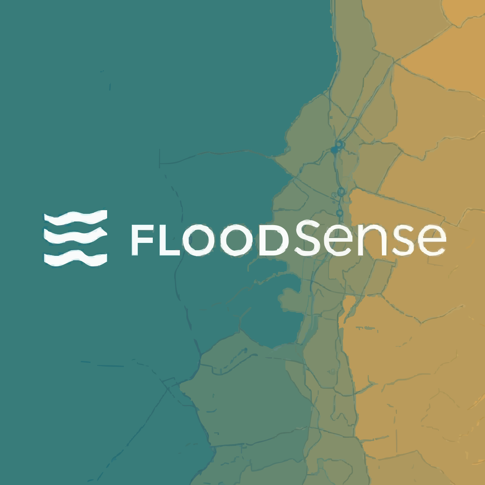

# FloodSense

<p align="center">
  
</p>

<p align="center">
  <b>Ward-level flood intelligence platform for risk forecasting, alerting, and response planning.</b>
</p>

---

## Overview

FloodSense is a full-stack flood intelligence system designed for urban operations teams.  
It combines geospatial ward data, weather signals, and ML inference to produce risk scores, map visualizations, and dispatch-ready alerts.

### Core capabilities
- Live ward risk map with hover and drill-down
- Ward detail pages with risk drivers and trend history
- Demo mode with synthetic scattered-risk scenarios
- Alert preview and alert history by ward
- OpenWeather integration for rainfall context
- MLflow experiment tracking for model comparison

---

## Tech Stack

- **Frontend:** React, TailwindCSS, Framer Motion, React Router, React Query
- **Backend:** FastAPI, SQLAlchemy
- **Data:** PostgreSQL + PostGIS
- **ML:** LightGBM, XGBoost, LSTM (PyTorch), SHAP
- **Orchestration:** Prefect
- **Experiment Tracking:** MLflow
- **Infra:** Docker Compose

---

## Architecture

```text
Frontend (React)
   └── calls FastAPI (/api/v1/*)
          ├── reads/writes predictions + alerts in Postgres/PostGIS
          ├── triggers internal inference route
          └── exposes weather + system status routes

ML Inference (Python models)
   └── computes ward risk scores + tiers + intervals + drivers
          └── persists outputs for map, ward pages, and alert feed

Prefect Flows
   └── ingestion + refresh pipelines (weather/features)
```

---

## Quick Start (Local)

### Prerequisites
- Docker Desktop
- Node.js 18+
- npm

### 1) Clone and configure
```bash
git clone https://github.com/akshat-shah-017/FloodSense.git
cd FloodSense
cp .env.example .env
```

### 2) Start platform services
```bash
docker compose up -d --build
```

### 3) Start frontend in dev mode
```bash
cd frontend
npm install
npm run dev -- --port 3002
```

### 4) Open apps
- Frontend (dev): `http://localhost:3002`
- Frontend (docker nginx): `http://localhost:3001`
- API: `http://localhost:8001`
- MLflow: `http://localhost:5001`
- Prefect: `http://localhost:4201`

---

## Demo Flow (Presentation-Friendly)

1. Open dashboard and show live ward map.
2. Toggle **Demo Mode** and run inference from the simulation bar.
3. Show risk color distribution change on map.
4. Show right-side AI decision feed and top risk wards.
5. Click a ward and open `/ward/:wardId` detail view.
6. Explain risk score, trend, drivers, and alert history.
7. Open MLflow and compare model runs/metrics.

---

## API Highlights

- `GET /api/v1/health` - platform health
- `GET /api/v1/predictions/current` - current ward GeoJSON predictions
- `GET /api/v1/predictions/{ward_id}` - ward detail data
- `GET /api/v1/alerts/mock-dispatch` - alert feed preview
- `GET /api/v1/alerts/log` - alert history log
- `GET /api/v1/weather/openweather` - weather status snapshot
- `POST /api/v1/internal/predict` - trigger inference run

Example:
```bash
curl -X POST http://localhost:8001/api/v1/internal/predict \
  -H "X-Internal-Secret: vyrus-internal-secret-change-me" \
  -H "Content-Type: application/json" \
  -d '{"rainfall_mm":60,"demo_mode":true}'
```

---

## Useful Commands

```bash
# Start everything
make up

# Stop everything
make down

# Tail logs
make logs

# Run DB init SQL
make migrate

# Train ML models (inside container)
make train-ml
```

---

## Deployment Notes (Demo)

For a low-cost public demo, deploy the full stack on one container host (Railway/Render/VM) and keep Postgres in the same deployment.  
Avoid Vercel-only deployment unless backend/DB are hosted separately.

---

## Security Notes

- Never commit `.env` files.
- Rotate API keys if they were ever exposed.
- Use `INTERNAL_API_SECRET` for protected internal inference routes.

---

## License

This project is currently for demo and educational use. Add a formal license before wider distribution.

